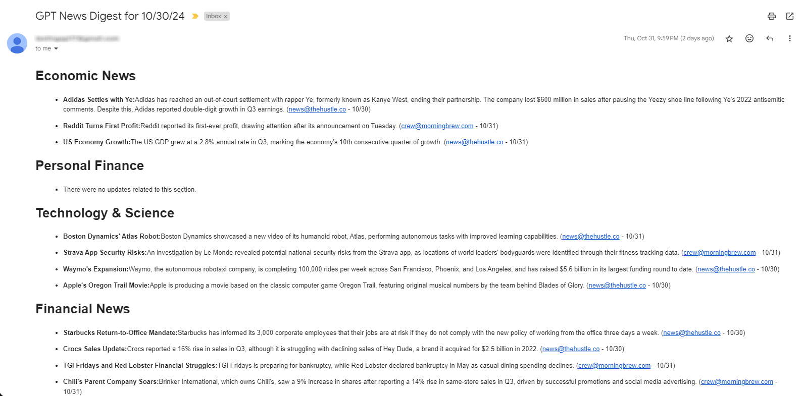

<h1 align="center">
  <br>
  <a href="https://github.com/adriantay21/AI_email_summarizer/"></a>
  <br>
  AI Email Summarizer
  <br>
</h1>

<h4 align="center">Another GPT wrapper that summarizes emails into digestible content</a>.</h4>


<p align="center">
  <a href="#key-features">Key Features</a> •
  <a href="#how-to-use">How To Use</a>
</p>



## Key Features

* Email Retrieval and Filtering: Automatically pulls and filters emails from the past 48 hours.
* AI-Powered Summarization and Categorization: Utilizes the GPT API to generate concise summaries of each email and organizes them by category.
* HTML Formatting: Converts summarized content into well-structured HTML for easy reading.
* Email Delivery: Sends the formatted HTML summaries directly to a designated personal mailbox.

## How To Use

To clone and run this application, you'll need [Git](https://git-scm.com) and [Python](https://www.python.org/downloads/) installed on your computer. You also need to provide your own OpenAI api key, IMAP/SMTP server addresses, and your login credentials.

From your command line:
```sh
# Clone this repository
git clone https://github.com/adriantay21/AI_email_summarizer

# Go into the repository
cd AI_email_summarizer

# Install required packages
pip install requirements.txt
```

Set these variables in your .env file:
```bash
OPENAI_API_KEY=APIKEY
EMAIL_ADDRESS=email@email.com
EMAIL_PASSWORD=password
IMAP_SERVER=imap.xxx.com
SMTP_SERVER=smtp.xxx.com
RECEIVER_EMAIL=email@email.com
FILTER_EMAILS="email1@email.com,email2@email.com,email3@email.com"
```

To run using docker:
```sh
docker pull adriantay21/aiemailsummarizer
docker run -d --name my_container_name adriantay21/aiemailsummarizer
```


